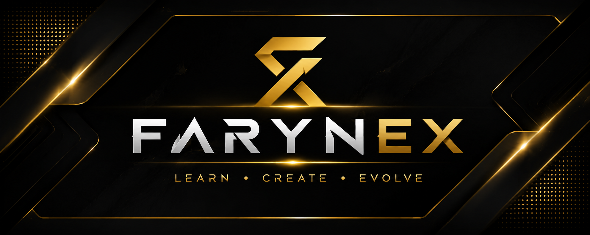

<!-- ===================== FARYNEX PROFILE ===================== -->

  

# FaryNex

  <strong>DEVELOPER • DIGITAL CREATOR • WRITER</strong>

  Informatics Engineering Student focused on software development,
  web applications, digital technology, and AI-powered creativity.

  
  
  

---

## TECH STACK

  
  &nbsp;&nbsp;&nbsp;
  
  &nbsp;&nbsp;&nbsp;
  
  &nbsp;&nbsp;&nbsp;
  
  &nbsp;&nbsp;&nbsp;
  
  &nbsp;&nbsp;&nbsp;
  

  PHP • Python • C# • JavaScript • HTML5 • CSS3

---

## WHAT I DO

| WEB & APPLICATION | TECHNOLOGY | AI CREATIVE | DIGITAL CREATIVE |
|:---:|:---:|:---:|:---:|
| Web Development | Hardware Service | AI Images | Book Writing |
| Application Development | Software Installation | AI Animation | Digital Content |
| Business Websites | Computer Troubleshooting | AI-assisted Creation | Creative Projects |

---

<h2 align="center">FEATURED PROJECTS</h2>

<table align="center">
<tr>

<td align="center" width="33%" valign="top">

<h3>Web Development</h3>

Independent websites and web-based solutions developed for personal,
business, and practical digital needs.

<strong>Core</strong> 
PHP • HTML5 • CSS3 • JavaScript

</td>

<td align="center" width="33%" valign="top">

<h3>Digital Business</h3>

Technology-driven projects and independent digital services focused on
practical solutions, usability, and creativity.

<strong>Focus</strong> 
Digital Services • Technology • Business Solutions

</td>

<td align="center" width="33%" valign="top">

<h3>AI &amp; Digital Creation</h3>

Exploring artificial intelligence for image creation, animation,
visual content, and creative workflows.

<strong>Focus</strong> 
AI Tools • Visual Creation • Digital Content

</td>

</tr>
</table>

  <strong>More projects and public repositories are currently being developed.</strong>

---

## CURRENTLY LEARNING

- Web Application Development
- Software & Application Development
- PHP & JavaScript
- Python
- C#
- Artificial Intelligence
- Digital Product Development
- Modern Development Workflows

---

## DEVELOPMENT PHILOSOPHY

> **Learn • Create • Evolve**

Technology is more than writing code.

I focus on understanding problems, building useful solutions, experimenting with new technologies, and continuously improving through real-world projects.

**Build with purpose. Learn continuously. Create something useful.**

---

## AREAS OF INTEREST

| AREA | FOCUS |
|:---|:---|
| 💻 Software Development | Web applications, desktop applications, and practical software |
| 🌐 Web Technology | PHP, JavaScript, HTML5, CSS3, responsive websites |
| 🐍 Python | Programming, automation, experimentation, and AI |
| 🤖 Artificial Intelligence | AI-assisted creativity and digital production |
| 🛠️ Technology | Hardware service, software installation, and troubleshooting |
| ✍️ Creative Technology | Writing, visual content, animation, and digital projects |

---

## CONNECT

  

  
    Email • Coming Soon &nbsp; | &nbsp;
    Portfolio • Coming Soon &nbsp; | &nbsp;
    Instagram • Coming Soon
  

---

  <strong>CODE • CREATE • BUILD</strong>

  © FaryNex Learn • Create • Evolve

